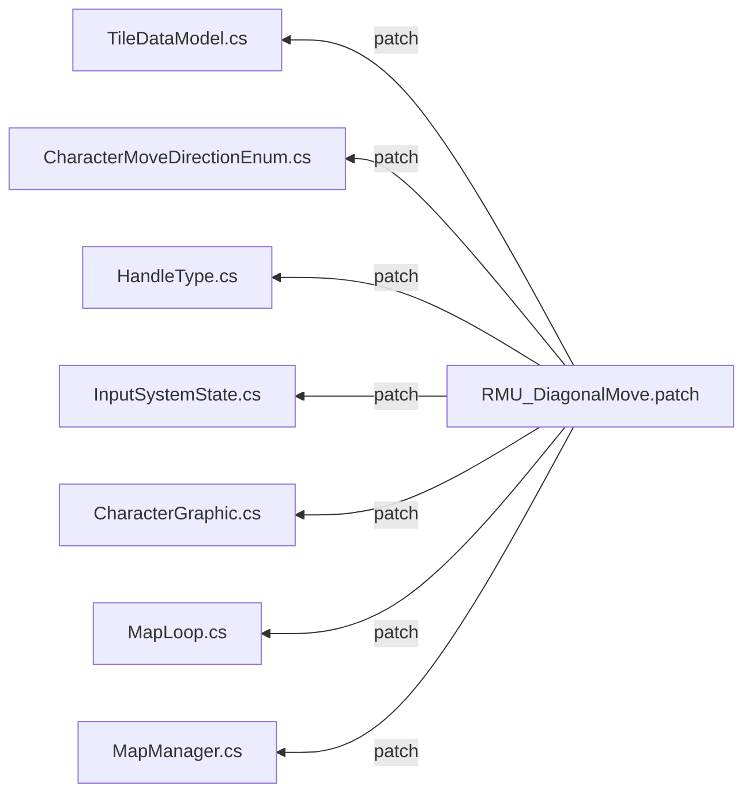

# Addon_DiagonalMove
RPGMakerUniteで斜め移動を実現します。<br />
グリッド移動は維持していますので、当たり判定などは同じです。<br />
<br />
※アドオンはパッチの管理用にご使用ください。

パッチの当て方等はこちらをご参照ください。<br />
[【RPGツクール】RPGMakerUniteのアドオン(プラグイン)作成入門 初級編](https://qiita.com/pepaperon_p/items/5b0179164af22d2891e1, "【RPGツクール】RPGMakerUniteのアドオン(プラグイン)作成入門 初級編")


| Addon |
|:-----------|
| [DiagonalMove.cs](https://raw.githubusercontent.com/pepaperon-p/Addon_DiagonalMove/main/DiagonalMove/DiagonalMove.cs "DiagonalMove.cs")|
| [RMU_DiagonalMove.patch](https://raw.githubusercontent.com/pepaperon-p/Addon_DiagonalMove/main/DiagonalMove/RMU_DiagonalMove.patch "RMU_DiagonalMove.patch")|


```
$ copy RMU_DiagonalMove.patch [プロジェクト]\Assets\RPGMaker\Codebase
$ cd [プロジェクト]\Assets\RPGMaker\Codebase
$ git apply RMU_DiagonalMove.patch
```
